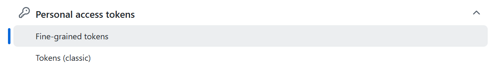
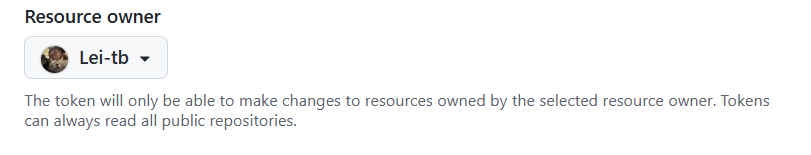
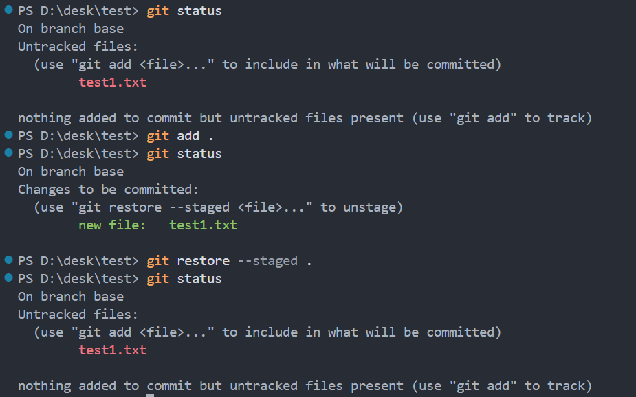
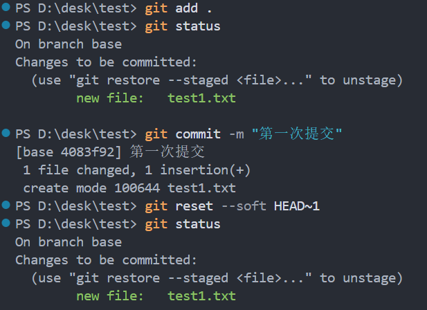
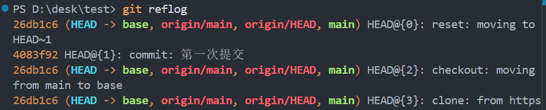
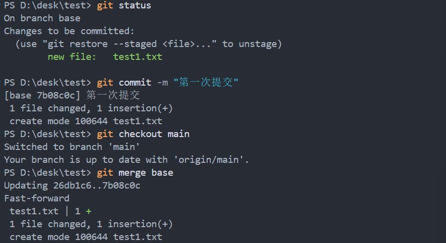
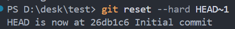
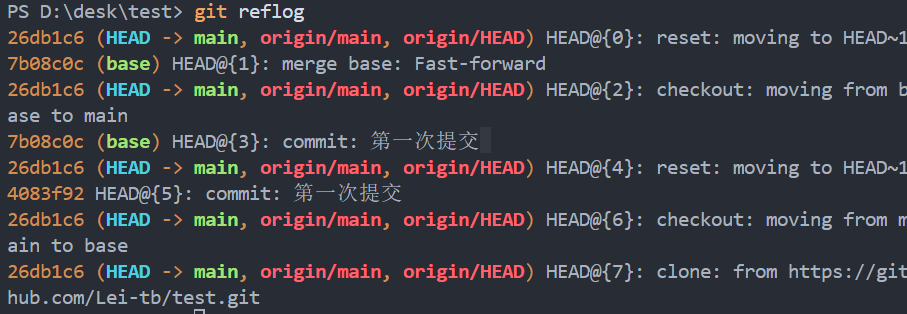
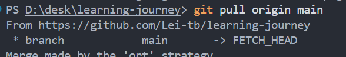
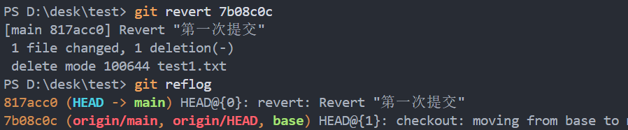

2026/4/18

---

1.新建工程

1. Public（公开仓库）

所有人都可以**访问和下载**，**仅**所有者和协作者才能**提交代码，其他人需要审核**

2. Private（私有仓库）

仅所有者和协作者才能**访问，下载和提交代码**

3. .gitignore里面写了什么就忽略什么， 永远不提交、不上传到 GitHub。

4. 没有 License = 别人啥都不能干

   MIT = 随便用，保留署名，作者不担责 


---


2.拉取


---


3.提交

(1)

**git status 是来确定在哪个分支的，同时给出三种情况：**

1. **改变还没准备提交 → 可以 add 或 restore**
2. **未被追踪的新文件 → 可以 add 追加**
3. **没有标记 → 提示你要 add**


(2) 创建新分支和切换分支，每个分支是独立的


(3)标记+提交+上传

 Git 只合并 **已经提交（commit）** 的版本，暂存区的内容是不能合并的。 

`git commit --amend` **作用：把 “本次修改” 追加到 “上一次 commit” 里，合并成一条提交！**


这里本地仓库和远程仓库没有建立连接




 让第三方软件能够操作我的github账号 



1. `Public repositories`

- 权限：**只能对所有公开仓库做「只读操作」**
- 限制：不能对你自己的任何仓库进行提交、修改、删除等写操作

2. `All repositories`

- 权限：对你账号下的 **所有仓库（包括现在和未来新建的）** 都开放你设置的权限，同时也能只读所有公开仓库

3. `Only select repositories`

- 权限：**只对你手动勾选的仓库生效**（最多 50 个），其他仓库完全没权限


**`Contents: Read and write`**：这是你 `git push` 提交代码必须的权限，对代码进行读写

**`Metadata: Read-only`**： 描述这个仓库的 “额外信息”  eg: 仓库的提交记录、分支信息 / 贡献者列表 


---

4.修改(首先肯定是不想让自己修改的代码因为撤销而消失)于是建立一个test 空repo

（1）add之后 commit之前 撤销add   

回到add之前并且保留修改内容



（2）commit之后，push/合并之前

1. --soft（最温和）

**回到目标版本 + 保留所有后来写的代码 + 保留暂存区**

2. --mixed（默认）

**回到目标版本 + 保留所有后来写的代码 + 清空暂存区**

3. --hard（危险！）

**回到目标版本 + 删除所有后来写的代码 + 彻底清空！**

```
git reset --soft HEAD~1/26db1c6
回到commit之前，add之后，并且没有改变版本号
```





（3）合并之后，push之前

 回到上一次提交并删除修改 不改变版本 





```
git reset --hard 26db1c6
```




or




```
git reset --hard 26db1c6
```


（4）push之后 撤销push   

这里还可以用,但是不推荐团队使用， **删除历史、强行覆盖** 的时候才会被拒绝： 

```
 git reset --hard 26db1c6
 
 git push origin main -f 或者  git push -f   #远程默认orgin,分支在main/base 就会推到 origin main/base
```

revert会参考版本和他的父版本修改了什么，直接反向修改



2. 如果你是 **合并（merge/pull）push 后错了**

```
git revert -m 1 HEAD
git push
```


