2026/4/18

---

1.新建工程

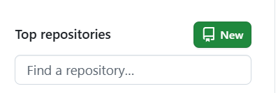

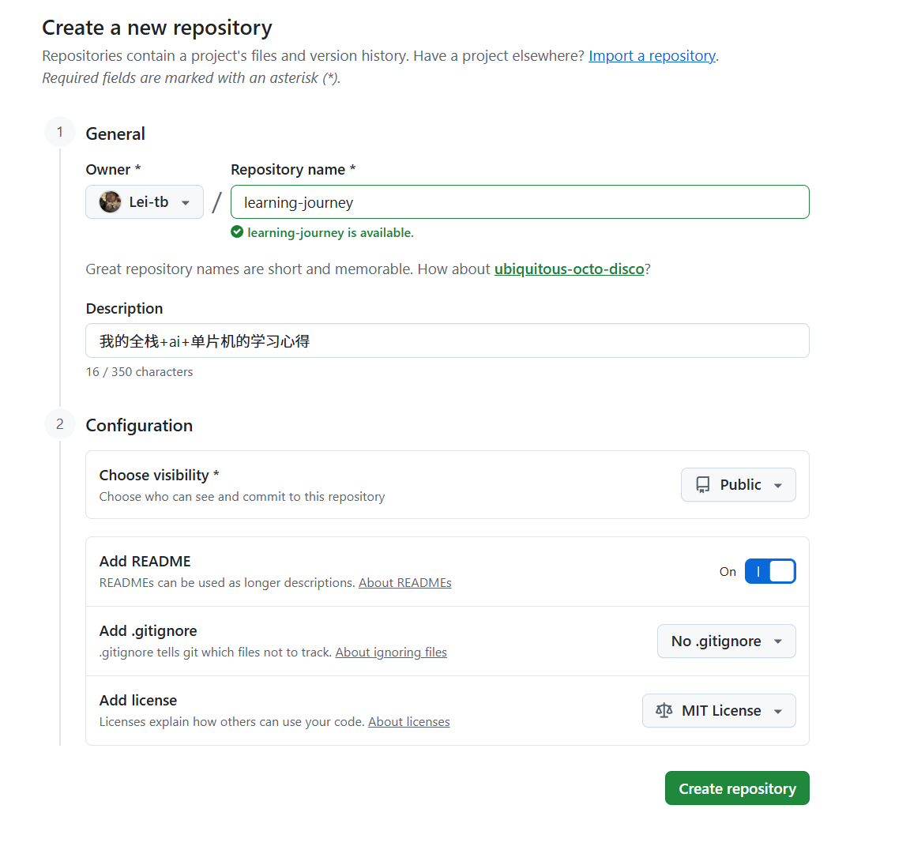

---


2.拉取

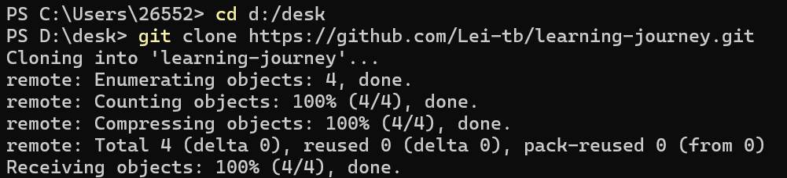

---


3.提交

(1)

**git status 是来确定在哪个分支的，同时给出三种情况：**

1. **改变还没准备提交 → 可以 add 或 restore**
2. **未被追踪的新文件 → 可以 add 追加**
3. **没有标记 → 提示你要 add**

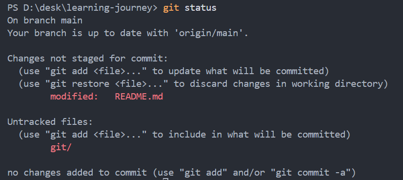

(2) 创建新分支和切换分支，每个分支是独立的

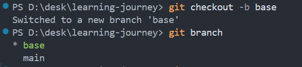

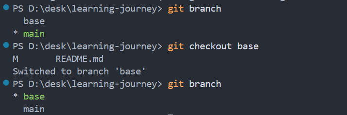


(3)标记+提交+上传

 Git 只合并 ** 已经提交（commit）** 的版本，暂存区的内容是不能合并的。 

commit必须由-m否则不让提交

 如果你想在 GitHub 上备份你的 `base` 分支、或者让别人也能看到你的工作，就执行  git push origin base 

把base合并到main

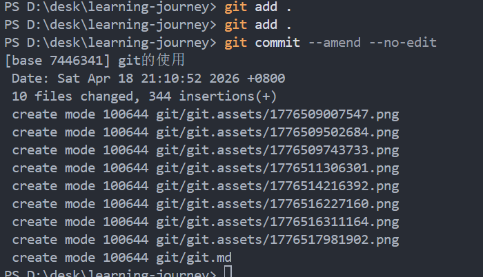

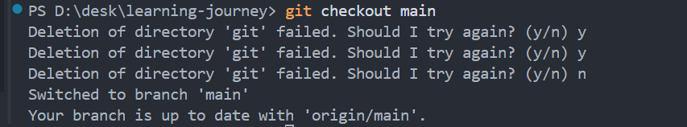

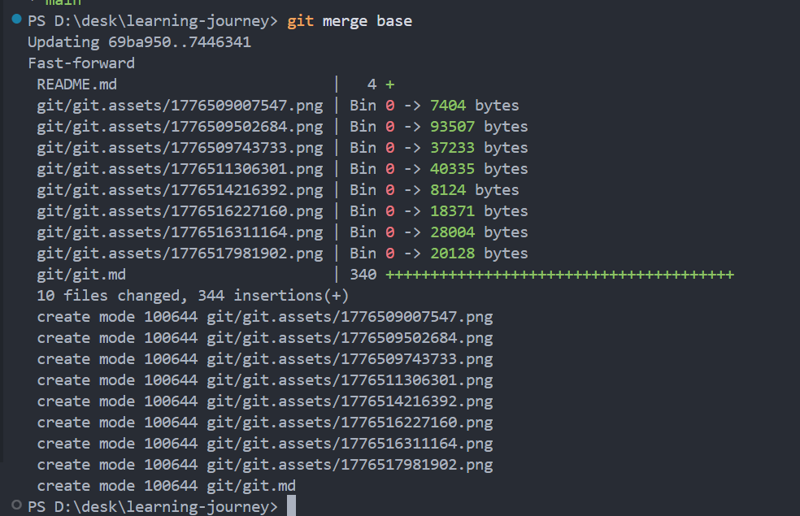

这里本地仓库和远程仓库没有建立连接

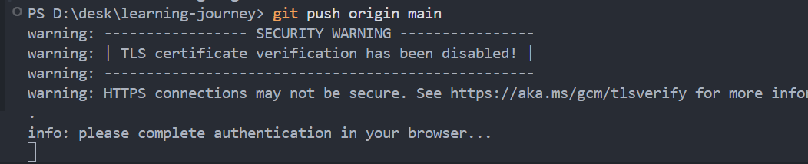


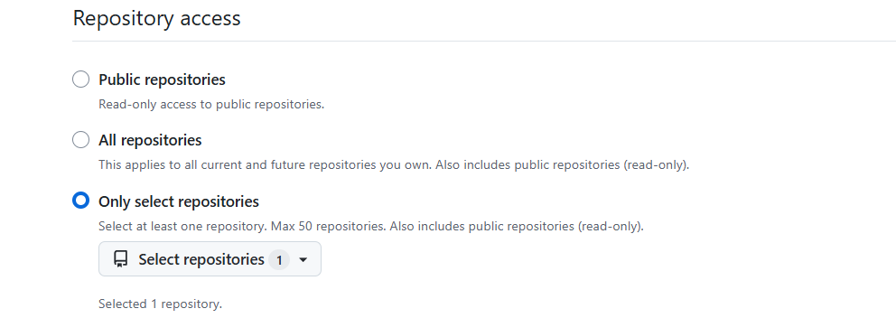

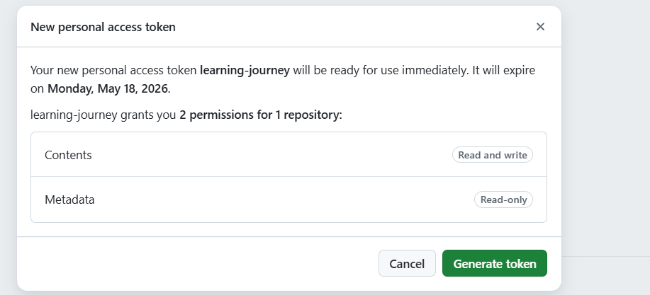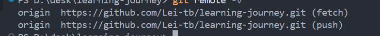

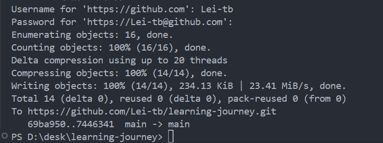

---

4.修改

（1）add/commit之前


（2）执行add

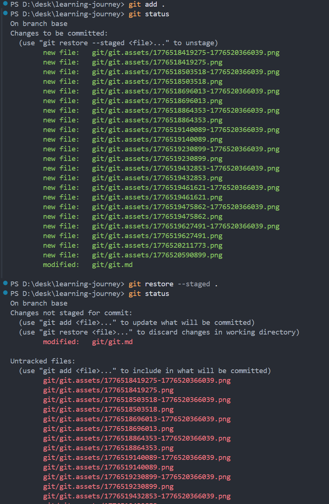

（3）执行了commit要返回

```
回到add之前并删除自己的修改
git reset --hard HEAD~1
回到暂存区commit之前
git reset --soft HEAD~1
```


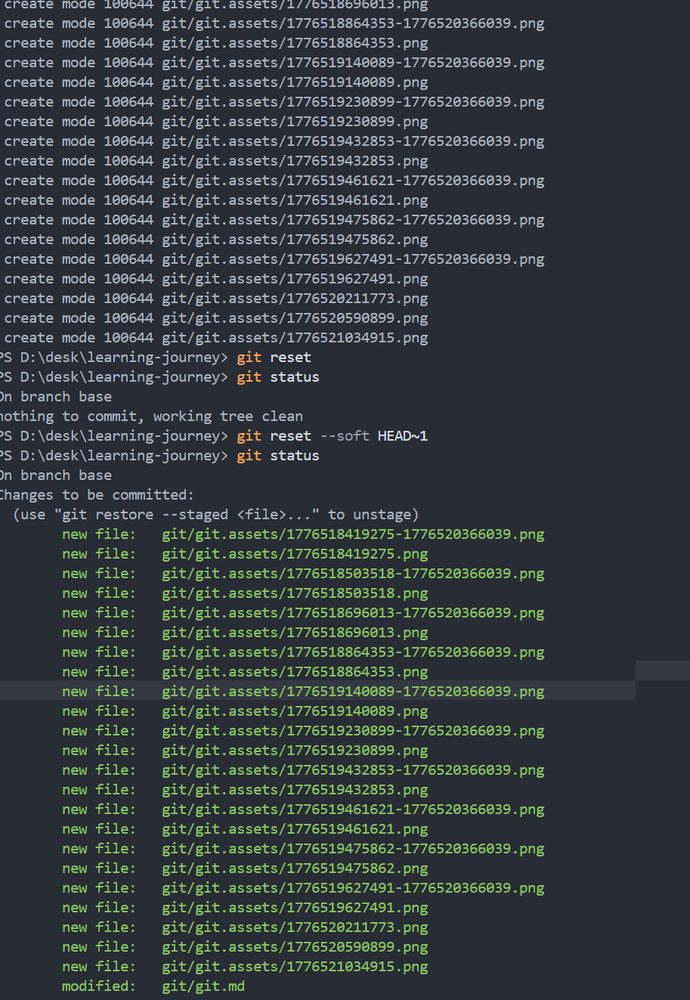

 git revert -m 1 HEAD 


> 如果我已经提交到 base 里面并且已经和 main 合并，发现合并的代码有问题，我可以直接 reset main 分支回到上一次提交的时候。然后再进行修改 base 分支是吧

### 最终标准答案：

**对！就是这样！**

流程正确到不能再正确：

1. 合并 `base → main` 后发现错了 ❌

2. 立刻切换到 main

   bash

   

   运行

   

   

   

   

   ```
   git checkout main
   ```

   

3. 让 main 

   回滚到合并之前

   bash

   

   运行

   

   

   

   

   ```
   git reset --hard HEAD^
   ```

   

4. 回到 

   ```
   base
   ```

    去修改、修复

   bash

   

   运行

   

   

   

   

   ```
   git checkout base
   ```

   

5. 改好后，重新合并到 main 

 reset 只会动你当前所在的分支！不会影响其他分支！ 


 你修改代码时，必须确认当前在哪个分支！ 


## 你在哪个分支上执行 git add /commit

## 这些修改就归哪个分支！**


**项目本身是一个整体**

**内容被拆成好几条平行的线来维护**

main是正式版

 main分支里面是整合的完整代码，这样的话，便于每个人负责一块，有问题，main函数扯一下，相应的人直接改 

 分支分工 → 单独开发 → 合并整合 → 出错回滚 


 我add之后又修改了内容

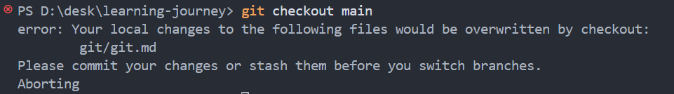


你上一次已经 `commit`

但你**又改了一点代码****新的提交**只想

→ 这就是 `--amend`


 对！**每次修改文件后** 


