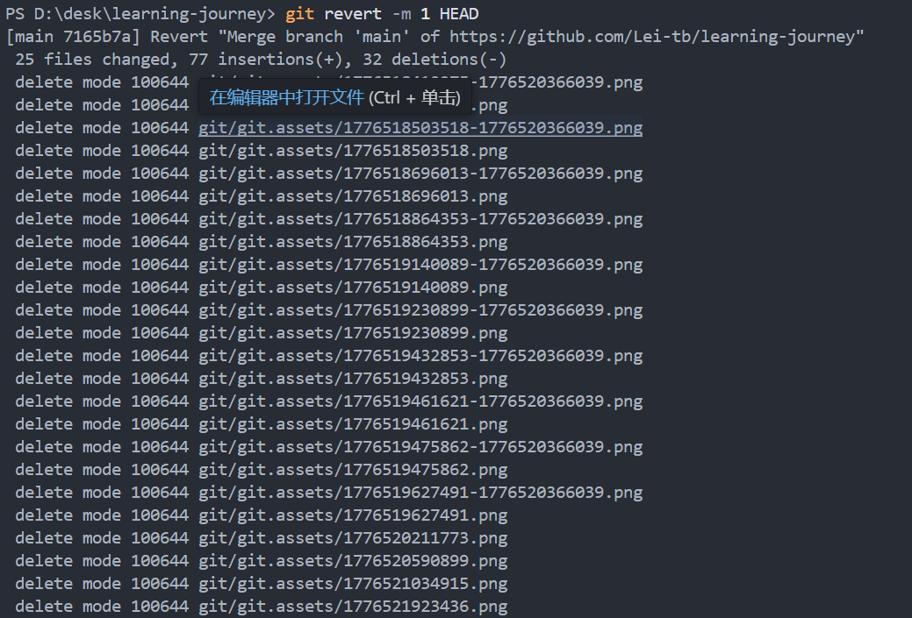

2026/4/18

---

1.新建工程


---


2.拉取


---


3.提交

(1)

**git status 是来确定在哪个分支的，同时给出三种情况：**

1. **改变还没准备提交 → 可以 add 或 restore**
2. **未被追踪的新文件 → 可以 add 追加**
3. **没有标记 → 提示你要 add**


(2) 创建新分支和切换分支，每个分支是独立的


(3)标记+提交+上传

 Git 只合并 ** 已经提交（commit）** 的版本，暂存区的内容是不能合并的。 

commit必须由-m否则不让提交

 如果你想在 GitHub 上备份你的 `base` 分支、或者让别人也能看到你的工作，就执行  git push origin base 

把base合并到main

`git commit --amend` **作用：把 “本次修改” 追加到 “上一次 commit” 里，合并成一条提交！**


这里本地仓库和远程仓库没有建立连接


---

4.修改(首先肯定是不想让自己修改的代码因为撤销而消失)

你在哪个分支上执行 git add /commit这些修改就归哪个分支

（1）add之后 commit之前 撤销add   


（2）commit之后，push/合并之前

```
commit之后修改就会从暂存区拿出，git reset是清除暂存区但是没有数据

回到暂存区commit之前，add之后
git reset --soft HEAD~1
```


（3）合并之后，push之前

```
git checkout main
git merge base
```

或者


```
git reset --hard HEAD~1
```


（4）push之后 撤销push   这里只会撤销main到上次提交，base不会被改变

```
git revert -m 1 HEAD   # 1. 本地生成撤销提交
git push    # 2. 把撤销提交推到远程
```



总结：

 main分支里面是整合的完整代码，每个人负责一块，有问题，main函数回滚一下，相应的人直接改 

 分支分工 → 单独开发 → 合并整合 → 出错回滚 

如果push之后发现有问题

## 1. 如果你是 **普通提交 push 后错了**

```
git revert HEAD
git push
```

## 2. 如果你是 **合并（merge/pull）push 后错了**

```
git revert -m 1 HEAD
git push
```


